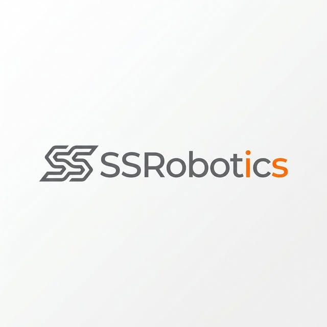

# 💾 Datasets & Demonstrations · SSRobotics

**Part of [Humanoid Robot Hub](https://github.com/SSRobotic/humanoid-robot-hub)** · [🔎 Search all resources](https://ssrobotic.github.io/humanoid-robot-hub/)

Robotics dataset catalogs, data formats and training data utilities.

คลัง Dataset หุ่นยนต์ รูปแบบข้อมูล และเครื่องมือจัดเตรียมข้อมูลฝึก

Curated by **SSRobotic — Robotics Engineer & Open-source Curator**. This repository is a focused resource directory and engineering guide. Linked SDKs, models and research implementations belong to their original creators.

## 🗂️ Resource directory

| Resource | What it provides | Keywords | Original source |
| --- | --- | --- | --- |
| [RoboMIND Dataset](https://huggingface.co/datasets/x-humanoid-robomind/RoboMIND) | Multi-embodiment demonstration data, including TienKung. See the dataset card for access conditions. | RoboMIND, Demonstrations, TienKung | [X-Humanoid / RoboMIND](https://huggingface.co/datasets/x-humanoid-robomind/RoboMIND) |
| [Open X-Embodiment](https://github.com/google-deepmind/open_x_embodiment) | Cross-embodiment robot dataset resources and supporting tooling. | Datasets, Cross-embodiment, Robotics | [google-deepmind](https://github.com/google-deepmind/open_x_embodiment) |
| [X-Humanoid Training Toolchain](https://github.com/Open-X-Humanoid/x-humanoid-training-toolchain) | Tools connecting TienKung / RoboMIND workflows with LeRobot. | TienKung, RoboMIND, LeRobot | [Open-X-Humanoid](https://github.com/Open-X-Humanoid/x-humanoid-training-toolchain) |
| [LeRobot](https://github.com/huggingface/lerobot) | Robot learning tools, datasets and policies. A supporting embodied AI resource; hardware support is project-specific. | Imitation learning, Datasets, Python | [huggingface](https://github.com/huggingface/lerobot) |
| [ArtVIP Assets](https://huggingface.co/datasets/X-Humanoid/ArtVIP) | Articulated-object digital-twin datasets and scene assets from X-Humanoid. | Digital twin, USD, Assets | [X-Humanoid](https://huggingface.co/datasets/X-Humanoid/ArtVIP) |

## 🚀 Start here

1. Select a dataset that matches the embodiment, task and sensing setup.
2. Review its access conditions, license, formats and train / evaluation split.
3. Inspect a small documented example and preserve task / frame metadata during conversion.

Read the [engineering guide](GUIDE.md) for a practical selection checklist. [resources.json](resources.json) contains the structured entries.

## 🔗 Explore the ecosystem

[🦾 Models & URDF](https://github.com/SSRobotic/humanoid-models) · [🌐 Simulation](https://github.com/SSRobotic/humanoid-simulation) · [🧠 Robot Learning](https://github.com/SSRobotic/humanoid-robot-learning) · [⚙️ Whole-body Control](https://github.com/SSRobotic/humanoid-whole-body-control) · [👁️ Vision & 3D Perception](https://github.com/SSRobotic/humanoid-vision) · [🤏 Manipulation & Planning](https://github.com/SSRobotic/humanoid-manipulation) · [🎮 Teleoperation](https://github.com/SSRobotic/humanoid-teleoperation) · [💾 Datasets & Demonstrations](https://github.com/SSRobotic/humanoid-datasets) · [💬 Vision-Language-Action](https://github.com/SSRobotic/humanoid-vla) · [🔌 Hardware & SDKs](https://github.com/SSRobotic/humanoid-hardware-sdks) · [📡 ROS & Integration](https://github.com/SSRobotic/humanoid-ros2) · [📚 Research & Benchmarks](https://github.com/SSRobotic/humanoid-research)

[🏠 Main Hub](https://github.com/SSRobotic/humanoid-robot-hub) · [🤖 Profile](https://github.com/SSRobotic)

## 🙌 Help this collection grow

⭐ [Star the Hub](https://github.com/SSRobotic/humanoid-robot-hub) · 👤 [Follow SSRobotic](https://github.com/SSRobotic) · 💡 [Suggest a resource](https://github.com/SSRobotic/humanoid-robot-hub/issues/new/choose)

Contribute accurate descriptions and original source links through the [Hub contribution guide](https://github.com/SSRobotic/humanoid-robot-hub/blob/main/CONTRIBUTING.md). Source terms, model compatibility and dataset access conditions remain with each upstream project.
